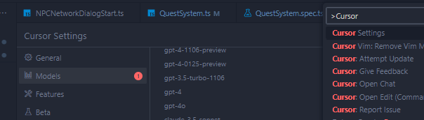
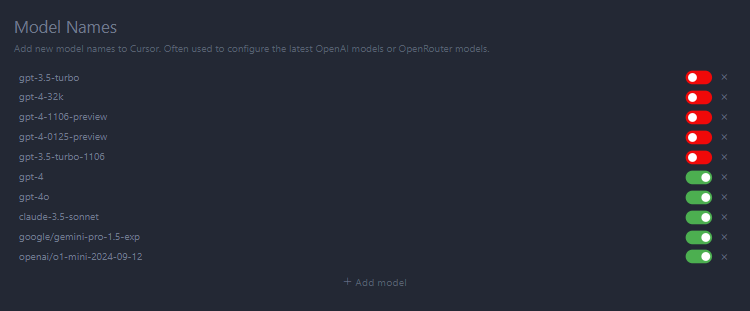

# Cursor

## Introduction

Cursor is a powerful tool designed to streamline your workflow by integrating advanced language models into your projects. Whether you're tackling simple queries or embarking on complex refactoring tasks, Cursor provides the flexibility and performance needed to enhance your productivity.

### Tutorials

- [Cursor Tutorial for Beginners (Summary)](https://www.youtube.com/watch?v=ocMOZpuAMw4)
- [Cursor AI Tutorial - Ultimate Guide (Recommended)](https://www.youtube.com/watch?v=gqUQbjsYZLQ&pp=ygUYQ3Vyc29yIEFJIHVsdGltYXQgZWd1aWRl)

## What is OpenRouter?

OpenRouter is an open-source routing framework that facilitates seamless communication between your applications and various language models. By leveraging OpenRouter, Cursor can efficiently manage and utilize different models to cater to a wide range of tasks, ensuring optimal performance and accuracy.

## How to Use Cursor with OpenRouter

Integrating Cursor with OpenRouter allows you to harness the full potential of multiple language models. Follow these steps to set up and configure the integration:

1. **Install Cursor:** Ensure you have Cursor installed in your development environment.
2. **Configure OpenRouter Key:**
   - Open the command pallet, type "> Cursor Settings"
   - Navigate to `Cursor settings > Models`.
   - Activate the **OpenAI API Key** option (note: the key does not need to be from OpenAI).
   - Paste your API key in the designated field.
   - Enter your OpenRouter URL.
3. **Activate Models:**
   - Ensure that the models you intend to use are listed and activated under the models section. Refer to the latest suggested models below.
4. **Start Using:**
   - With the setup complete, you can now utilize Cursor alongside OpenRouter to execute tasks using your selected language models.

For a detailed walkthrough, watch the following videos:
- [Cursor x OpenRouter Integration](https://youtu.be/KHraTjGROMc)
- [How to Use Cursor](https://youtu.be/aOvYDI5Wtgc)

## Suggested Models (As of September 18, 2024)

Choosing the right model is crucial for the efficiency and effectiveness of your tasks. Below are the recommended models based on their capabilities:

- **openai/o1-mini-2024-09-12**
  - **Use Case:** Suitable for moderate to complex questions.
  - **Features:** Offers deeper thinking capabilities with extensive output token limits, making it ideal for large-scale projects.

- **anthropic/claude-3.5-sonnet**
  - **Use Case:** Best for moderate difficulty questions requiring faster responses.
  - **Features:** Excels in handling a variety of smaller tasks efficiently.

- **openai/gpt-4o-mini-2024-07-18**
  - **Use Case:** Perfect for simple questions or small refactoring tasks.
  - **Features:** Provides quick and accurate answers for straightforward queries.

## o1-mini vs. Claude Sonnet 3.5: Conclusions

When deciding between **o1-mini** and **Claude Sonnet 3.5**, consider the scope and nature of your project:

- **o1-mini:**
  - **Best For:** Massive refactoring jobs or greenfield projects requiring substantial development.
  - **Advantages:** Combines deeper cognitive processing with large output token limits, enabling one-shot solutions for complex tasks.
  - **Usage Tip:** Craft highly specific and detailed prompts to maximize efficiency. o1-mini is designed for comprehensive tasks rather than conversational interactions or minor bug fixes.

- **Claude Sonnet 3.5:**
  - **Best For:** Collections of smaller, individual tasks.
  - **Advantages:** Remains the top choice among closed-source coding LLMs for handling diverse, smaller-scale coding challenges with speed and reliability.
  - **Usage Tip:** Utilize Claude Sonnet 3.5 for its agility in managing multiple concise tasks effectively.

**Analogy:** Think of **o1-mini** as a Ferrari—built for high performance and large-scale tasks—while **Sonnet** is akin to a reliable Honda, perfect for everyday, smaller tasks.

## Setting Up Your OpenRouter Key

To integrate your OpenRouter key with Cursor, follow these steps:

1. **Access Cursor Settings:**
   - Open Cursor and navigate to `Settings > Models`.

2. **Activate OpenAI API Key:**
   - Toggle the **OpenAI API Key** option to activate it.

3. **Enter Your Credentials:**
   - **API Key:** Paste your OpenRouter API key into the designated field.
   - **URL:** Enter your OpenRouter URL.

4. **Ensure Model Activation:**
   - Verify that the models you intend to use are listed and activated under the models section. Refer to the [Suggested Models](#suggested-models-sept-181924) section for the latest recommended models.

## Additional Resources

Enhance your understanding and usage of Cursor and its integrations with these resources:

- **Article:**
  - [How to Use Claude 3 on Cursor AI](https://medium.com/ai-creators/how-to-use-claude-3-on-cursor-ai-855edee19c6e)

- **Videos:**
  - [Cursor x OpenRouter Integration](https://youtu.be/KHraTjGROMc)
  - [How to Use Cursor](https://youtu.be/aOvYDI5Wtgc)

For more detailed guides and tutorials, visit the official Cursor documentation or explore community forums and support channels.

---

*Last Updated: October 22, 2024*
