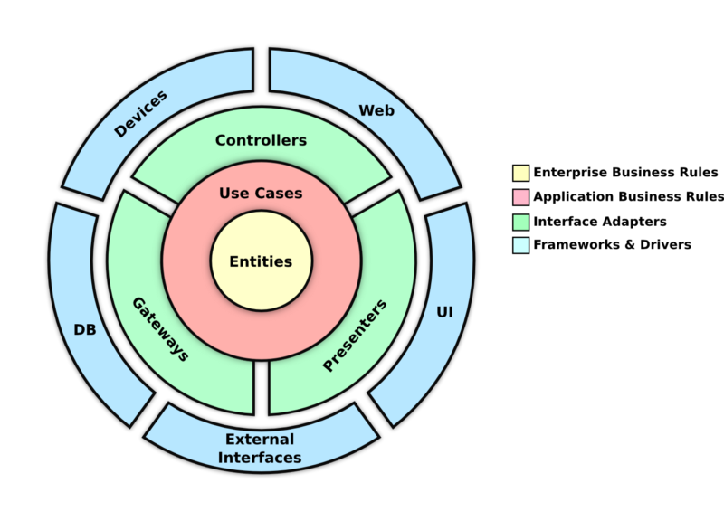
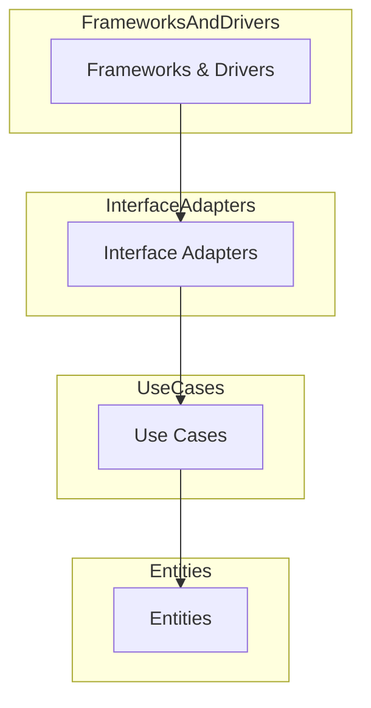
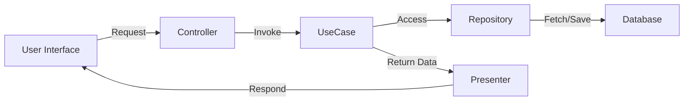
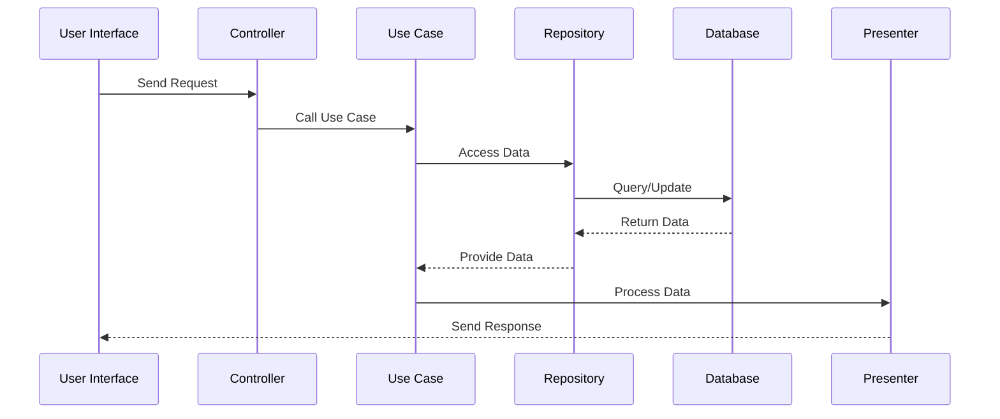
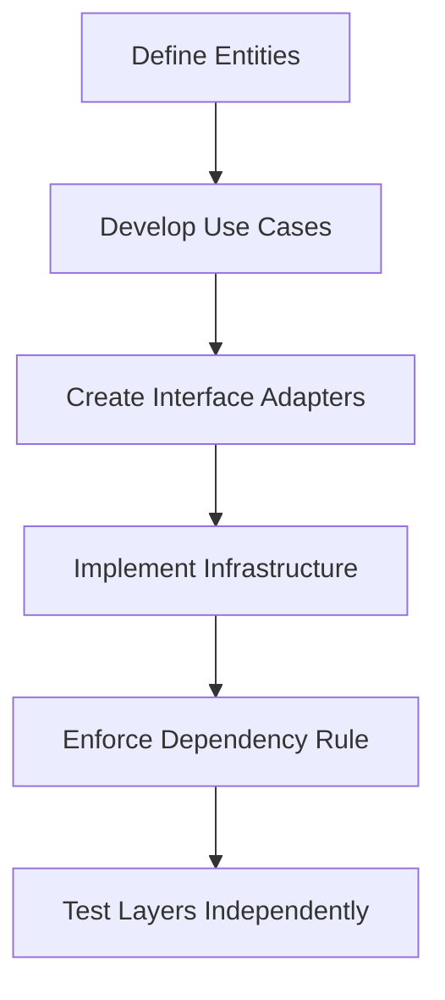

# Clean Architecture

## Introduction

**Clean Architecture** is a software design philosophy introduced by **Robert C. Martin** (Uncle Bob). It aims to create systems that are:

- **Maintainable**: Easy to understand and modify.
- **Testable**: Facilitates writing automated tests.
- **Flexible**: Adapts to changes in requirements or technologies with minimal impact.
- **Independent of Frameworks**: Not tightly coupled to any specific technology or library.
- **Independent of UI**: The user interface can be changed without altering the business logic.
- **Independent of Databases**: Business rules aren't affected by the choice of database or data source.

Clean Architecture achieves these goals by organizing the system into concentric layers, each with specific responsibilities and dependencies.

## Watch before proceeding...

[🎥 How our API works](https://www.youtube.com/watch?v=UOgEzvrsHOs)

[🎥 Clean Architecture in 3 minutes](https://www.youtube.com/watch?v=MBlHCJtQa9k)

[🎥 Watch this intro video](https://www.youtube.com/watch?v=1OLSE6tX71Y)

---

## Core Principles

1. **Separation of Concerns**: Different parts of the system handle distinct responsibilities.
2. **Single Responsibility**: Each module or class has one reason to change.
3. **Dependency Inversion**: High-level modules should not depend on low-level modules; both should depend on abstractions.
4. **Abstraction Over Implementation**: Depend on interfaces or abstract classes rather than concrete implementations.
5. **Encapsulation**: Hide the internal details of each layer from others.

---

## Architecture Layers

Clean Architecture is typically visualized as concentric circles, each representing a layer with specific roles. The inner layers are more abstract and less dependent on external factors, while the outer layers handle implementation details.

### 1. Entities (Domain Layer)

- **Purpose**: Represent the core business logic and rules.
- **Characteristics**:
  - **Business Entities**: Fundamental objects that encapsulate business data and behavior.
  - **Pure and Independent**: Free from external dependencies like databases or frameworks.
  - **Examples**: User, Order, Product in an e-commerce system.

### 2. Use Cases (Application Layer)

- **Purpose**: Define the application's specific business rules and orchestrate the flow between entities and external systems.
- **Characteristics**:
  - **Interactors**: Implement use case logic.
  - **Application-Specific**: Focused on tasks the application performs.
  - **No UI or Database Code**: Interact with abstractions instead.

### 3. Interface Adapters

This layer adapts data from the use cases and entities to formats suitable for external systems like databases and user interfaces.

#### Controllers

- **Purpose**: Handle incoming requests (e.g., HTTP requests) and delegate actions to use cases.
- **Characteristics**:
  - **Receive Input**: From UI or API clients.
  - **Invoke Use Cases**: Pass necessary data to the application layer.

#### Presenters/ViewModels

- **Purpose**: Prepare data for the user interface.
- **Characteristics**:
  - **Format Data**: Transform business objects into UI-friendly formats.
  - **Handle Responses**: Package use case outputs for the UI.

#### Repositories

- **Purpose**: Abstract data access, allowing use cases to interact with data sources without knowing their details.
- **Characteristics**:
  - **Interface Definitions**: Define methods for data operations.
  - **Implementations**: Handle actual data storage and retrieval.

### 4. Frameworks & Drivers (Infrastructure Layer)

- **Purpose**: Handle all external concerns like databases, web frameworks, and other tools.
- **Characteristics**:
  - **Implementation Details**: Actual code for interacting with external systems.
  - **Conforms to Interfaces**: Implements repository interfaces defined in the interface adapters layer.

---

## Dependency Rule

A fundamental rule in Clean Architecture is the **Dependency Inversion Principle**, which dictates that:

- **Source Code Dependencies**: Must point **inward**. Outer layers can depend on inner layers, but inner layers should never depend on outer layers.
- **Abstractions**: Inner layers define interfaces that outer layers implement.

**Visual Representation:**

This ensures that the core business logic remains unaffected by changes in external systems or technologies.

---

## Data Flow in Clean Architecture

Understanding how data flows through the layers is crucial for implementing Clean Architecture effectively.

### Use Case Interaction

**Mermaid Diagram: Layered Interaction**

1. **User Interface** sends a request to the **Controller**.
2. **Controller** invokes the appropriate **Use Case**.
3. **Use Case** interacts with the **Repository** to access or modify data.
4. **Repository** communicates with the **Database** or other data sources.
5. **Use Case** processes the data and sends it to the **Presenter**.
6. **Presenter** formats the data for the **User Interface** and sends the response back.

### Request-Response Cycle

**Mermaid Diagram: Request-Response Flow**

1. **User Interface** initiates a request.
2. **Controller** receives the request and calls the **Use Case**.
3. **Use Case** interacts with the **Repository** to access or modify data.
4. **Repository** communicates with the **Database**.
5. Data flows back through the layers to the **Presenter**.
6. **Presenter** formats and sends the response back to the **User Interface**.

---

## Benefits of Clean Architecture

1. **Maintainability**: Clear separation of concerns makes the codebase easier to navigate and modify.
2. **Testability**: Business logic can be tested in isolation without relying on external systems.
3. **Flexibility**: Easily swap out frameworks, databases, or other external components without impacting core logic.
4. **Scalability**: Well-organized codebase can handle growth and complexity more effectively.
5. **Reusability**: Business rules and use cases can be reused across different parts of the application or even different projects.
6. **Independent Deployment**: Layers can be developed and deployed independently, facilitating parallel development and continuous integration.

---

## Implementing Clean Architecture

Implementing Clean Architecture involves structuring your project to adhere to the layered approach and ensuring that dependencies flow inward. Here's a high-level overview of the implementation steps:

1. **Define the Core Entities**: Identify and model the essential business entities that encapsulate your domain logic.
2. **Develop Use Cases**: Create application-specific business rules that orchestrate the interactions between entities and external systems.
3. **Create Interface Adapters**: Develop controllers, presenters, and repositories that adapt data between the use cases and external interfaces.
4. **Implement Infrastructure**: Build the actual implementations for data storage, external services, and frameworks, ensuring they conform to the interfaces defined in the adapters.
5. **Enforce Dependency Rule**: Use interfaces and abstractions to ensure that inner layers do not depend on outer layers.
6. **Test Layers Independently**: Write tests for each layer in isolation to ensure their correctness and adherence to business rules.

**Mermaid Diagram: Implementation Flow**

 
---

## Additional Resources

- **[Clean Architecture by Robert C. Martin](https://www.amazon.com/Clean-Architecture-Craftsmans-Software-Structure/dp/0134494164)**: The foundational book on Clean Architecture.
- **[Uncle Bob's Blog](https://blog.cleancoder.com/)**: Insights and articles on software design and Clean Architecture.
- **[Clean Architecture GitHub Examples](https://github.com/iluwatar/java-design-patterns/tree/master/clean-architecture)**: Practical implementations in various programming languages.
- **[Mermaid Live Editor](https://mermaid.live/)**: Tool to create and visualize Mermaid diagrams.

Feel free to explore these resources to deepen your understanding and see Clean Architecture applied in different contexts.
