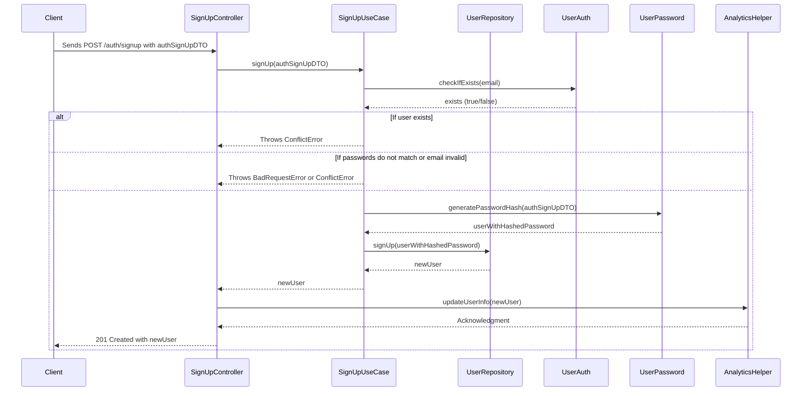

# Examples
 
As discussed in the [Clean Architecture](./clean-architecture.md) section, we can identify four layers:

1. Presentation Layer
2. Application Layer
3. Domain Layer
4. Infrastructure Layer

Let's use an example of the overall data flow of our API, taken from the User SignUp flow, for better understanding about how does everything fits together.

## Example Overview



## Details

### 1. Presentation Layer

**Responsibility**: Handles user interfaces, API endpoints, and user interactions.

**Example**: `SignUpController.ts`

```typescript
@controller("/auth")
export class SignUpController implements interfaces.Controller {
  constructor(private signupUseCase: SignUpUseCase, private analyticsHelper: AnalyticsHelper) {}

  @httpPost("/signup", rateLimiter, DTOValidatorMiddleware(AuthSignUpDTO))
  public async signUp(@requestBody() authSignUpDTO, @request() req, @response() res): Promise<IUser> {
    const newUser = await this.signupUseCase.signUp(authSignUpDTO);

    await this.analyticsHelper.updateUserInfo(newUser);

    return res.status(HttpStatus.Created).send(newUser);
  }
}
```

**Explanation**:
- **Controller**: Manages HTTP requests and responses.
- **Dependencies**: `SignUpUseCase` (Application Layer) and `AnalyticsHelper` (Infrastructure Layer) are injected, adhering to the Dependency Inversion principle.
- **Middleware**: `DTOValidatorMiddleware` ensures request data integrity.

### 2. Application Layer

**Responsibility**: Contains business use cases and application-specific logic.

**Example**: `SignUpUseCase.ts`

```typescript
@provide(SignUpUseCase)
export class SignUpUseCase {
  constructor(private userRepository: UserRepository, private userAuth: UserAuth, private userPassword: UserPassword) {}

  public async signUp(authSignUpDTO: AuthSignUpDTO): Promise<IUser> {
    const { email, password, passwordConfirmation } = authSignUpDTO;

    if (password !== passwordConfirmation) {
      throw new ConflictError(TS.translate("auth", "passwordDoesNotMatchConfirmation"));
    }

    if (await this.userAuth.checkIfExists(email)) {
      throw new ConflictError(TS.translate("users", "userAlreadyExists", { email }));
    }

    if (!validate(email)) {
      throw new BadRequestError("Sorry, your e-mail is invalid");
    }

    authSignUpDTO.email = authSignUpDTO.email.toLocaleLowerCase();

    const userWithHashedPassword = await this.userPassword.generatePasswordHash(authSignUpDTO);

    const newUser = await this.userRepository.signUp(userWithHashedPassword);

    return newUser;
  }
}
```

**Explanation**:
- **Use Case**: Encapsulates the sign-up process, orchestrating validation, authentication checks, password hashing, and user creation.
- **Dependencies**: `UserRepository` (Infrastructure Layer), `UserAuth`, and `UserPassword` handle data persistence and security.

### 3. Domain Layer

**Responsibility**: Represents the core business logic and entities.

**Example**: `UserModel.ts`

```typescript
@provide(UserModel)
export class UserModel extends BaseModel<ZodType<IUser>> {
  protected get modelName(): string {
    return "User";
  }
}
```

**Explanation**:
- **Entity**: `UserModel` defines the structure and behavior of the `User` entity.
- **Inheritance**: Extends `BaseModel` to leverage shared functionalities across entities.

### 4. Infrastructure Layer

**Responsibility**: Handles technical concerns like data persistence, external services, and utilities.

**Examples**:
- `BaseRepository.ts`
- `UserRepository.ts`

#### `BaseRepository.ts`

```typescript
@provide(BaseRepository)
export class BaseRepository<T extends AvailableSchemas> implements IBaseRepository<T> {
  constructor(private repositoryAdapter: IRepositoryAdapter<T, Record<string, unknown>>) {}

  public async create(data: Partial<T>, options?: IBaseRepositoryCreateOptions): Promise<T> {
    // Implementation...
  }

  // Other CRUD methods...
}
```

**Explanation**:
- **Generic Repository**: `BaseRepository` provides common data access methods, promoting code reuse.
- **Error Handling**: Centralizes error management, throwing domain-specific errors like `BadRequestError` and `ConflictError`.

#### `UserRepository.ts`

```typescript
@provide(UserRepository)
export class UserRepository extends BaseRepository<IUser> implements IBaseRepository<IUser> {
  constructor(
    private analyticsHelper: AnalyticsHelper,
    private repositoryFactory: RepositoryFactory,
    private userModel: UserModel
  ) {
    super(repositoryFactory.createRepository<IUser>(userModel.initializeData(userSchema), userSchema));
  }

  public async signUp(newUserData: IUser): Promise<IUser> {
    const newUser = await this.create(newUserData, {
      uniqueByKeys: "email",
    });

    void this.analyticsHelper.track("UserRegister", newUser);
    void this.analyticsHelper.updateUserInfo(newUser);

    return newUser;
  }
}
```

**Explanation**:
- **Specialized Repository**: `UserRepository` extends `BaseRepository` to handle `User`-specific data operations.
- **Dependency Injection**: Utilizes `AnalyticsHelper` for tracking user registration, adhering to the Repository Pattern and ensuring no direct database model access.

## Dependency Management

Adhering to the Dependency Inversion principle, higher-level modules like controllers and use cases depend on abstractions (interfaces) rather than concrete implementations. This is facilitated by InversifyJS, allowing for flexible and testable code.

```typescript
constructor(private signupUseCase: SignUpUseCase, private analyticsHelper: AnalyticsHelper) {}
```

**Explanation**:
- Dependencies are injected, promoting loose coupling and easier scalability.

## Repository Pattern

Repositories act as intermediaries between the domain and data mapping layers, providing a collection-like interface for accessing domain objects.

```typescript
export class UserRepository extends BaseRepository<IUser> implements IBaseRepository<IUser> {
  // Implementation...
}
```

**Benefits**:
- **Abstraction**: Hides data access details from the rest of the application.
- **Consistency**: Provides a uniform API for data operations across different entities.
- **Testability**: Facilitates mocking and testing by depending on repository interfaces.

## Type Safety with TypeScript

Our codebase leverages TypeScript's strong typing to ensure reliability and maintainability.

- **Interfaces with I Prefix**: Defines clear contracts for entities and repositories.
  
  ```typescript
  export interface IBaseRepository<T extends AvailableSchemas> extends IRepositoryAdapter<T, Record<string, unknown>> {}
  ```

- **Return Types**: Functions specify return types, enhancing clarity and preventing unintended behavior.
  
  ```typescript
  public async signUp(@requestBody() authSignUpDTO, @request() req, @response() res): Promise<IUser> {
    // Implementation...
  }
  ```

## Error Handling

Centralized error handling enhances consistency and simplifies debugging.

```typescript
public async create(data: Partial<T>, options?: IBaseRepositoryCreateOptions): Promise<T> {
  try {
    // Implementation...
  } catch (error) {
    throw new BadRequestError(error.message);
  }
}
```

**Explanation**:
- **Custom Errors**: Utilizes domain-specific errors like `BadRequestError` and `ConflictError` to convey precise issues.
- **Error Translation**: Integrates with translation helpers (`TS.translate`) to provide localized error messages.

## Middleware and Validation

Ensures data integrity and security through validation middleware.

```typescript
@httpPost("/signup", rateLimiter, DTOValidatorMiddleware(AuthSignUpDTO))
public async signUp(@requestBody() authSignUpDTO, @request() req, @response() res): Promise<IUser> {
  // Implementation...
}
```

**Explanation**:
- **Rate Limiting**: Prevents abuse by limiting the number of sign-up attempts.
- **DTO Validation**: Validates incoming data against `AuthSignUpDTO`, ensuring only well-formed requests are processed.

## Conclusion

By adhering to Clean Architecture principles, our TypeScript codebase achieves a modular, maintainable, and scalable system. Each layer has distinct responsibilities, dependencies are managed through inversion and dependency injection, and the repository pattern abstracts data access. Leveraging TypeScript's type safety and centralized error handling further enhances the robustness of the application. This architectural approach facilitates easy testing, future enhancements, and seamless collaboration among developers.
