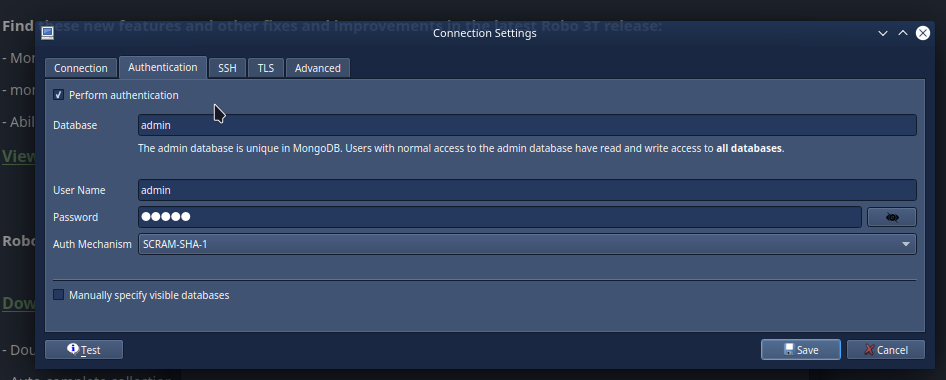

# Robo3T

Robo3T is a free and open-source cross-platform MongoDB management tool. It's a GUI that allows you to view and interact with your MongoDB databases.

- **Download Link:** [Robo3T v1.4.4](https://github.com/Studio3T/robomongo/releases/download/v1.4.4/robo3t-1.4.4-windows-x86_64-e6ac9ec5.exe)
  
## Basic Usage

You can watch this [video to get familiar with the basic usage of Robo3T](https://www.youtube.com/watch?v=DKZr1Urs7sA&pp=ygUGcm9ibzN0)

### Starting the Containers

- Ensure you have a `.env` file in your `startup-api` and `startup-client` folders. You can create it by running `yarn configure` inside your project root folder.
- Simply run:

  ```bash
  docker-compose up
  ```

- **Important:** You **DON’T** need to run `npm` or `yarn run dev` after the containers are up and running! Docker already does it for you.

### .env Configuration

To use Robo3T as your database GUI, you need to have mongodb module properly activated in your `.env` file.

Open your `startup-api` .env and make sure you have the following:

```bash 
...
# Databases (firebase, mongoose)
DB_ADAPTER=mongoose

...
MODULE_MONGODB=true
```

After setting this up, please run `yarn module:build`. This will dynamically configure your docker-compose.yml file to support MongoDB and it will also rebuild your containers.

### Visualizing Data

1. **Ensure Docker DB Container is Running:**
   - Make sure that your Docker DB container (`startup-db`) is up and running.

2. **Install Robo3T:**
   - Make sure you have Robo3T already installed, from the link above.

3. **Connect to Database:**

   
   _Make sure all fields below are properly filled, as demonstrated on the image above._
   

   - Open Robo3T.
   - Click on the **"File"** option, then on **"Connect..."**.
   - Create a new connection with the following settings:
     - **Connection Tab:**
       - **Name:** Startup Engine Dev
       - **Address:** localhost
       - **Port:** 27018 (or the port you have in your .env file)
     - **Authentication Tab:**
       - **Database:** admin
       - **User Name:** admin
       - **Password:** 31416
       - **Auth Mechanism:** SCRAM-SHA-1

### Seeding Your Database with Dummy Data (optional)

Note that this step is optional and will only work once the project is deployed. You also must have proper authorization on the main VPS to run these commands. So, if you're interested, please contact our team to give you proper access.

1. **Access Your `startup-api` Project:**

2. **Run the Containers:**

   ```bash
   docker-compose up
   ```

   - Make sure `startup-db` is active.

3. **Download and Import Dummy Database:**

   ```bash
   yarn db:download
   yarn db:import
   ```

4. **Verification:**
   - Done! You can check your imported data in Robo3T.

### Alternative NoSQL GUIs

#### Studio3T
Studio3T is a paid version of Robo3T. It's a GUI that allows you to view and interact with your MongoDB databases. From my personal experience, I found it to be more complex and less user-friendly than Robo3T. You can [watch a guide here](https://www.youtube.com/watch?v=p5BmYfN_a7w), if you're interested in using it.
