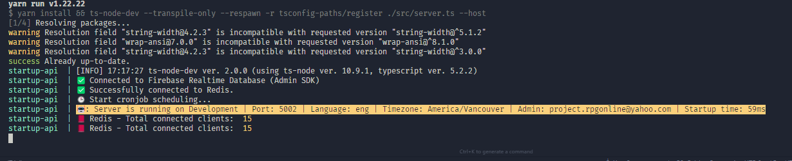

# Getting Started

## Pre-requisites

**OS setup**

 - Make sure you've followed our [OS setup](../os/os-setup.md) and everything is working fine.

## Preparing your environment

- Clone [startup-api](https://github.com/startup-bootstrap-engine/startup-api) inside of your `~/startup-engine` folder, as suggested in our [general overview](../general-overview/getting-started.md).

- Run `yarn install` to install the dependencies.

- Run `yarn configure:first-time` to configure your project.
  - Besides setting up your .env and docker-compose files, this will guide you through the Google Cloud CLI (gcloud) installation, which is required for fetching some of the secret files. If something fails on this step, please contact the team leader for him to add your access credentials on Google Cloud.

- Make sure to turn on `Docker Desktop`, if you're on Windows or Mac.

- Run `docker-compose up` to start the project (or, if your aliases are setup [through our automated OS setup](../os/automated-os-setup.md), just run `dcup`).
  - On the first run, it will take a while to download the Docker dependencies. Go get some coffee ☕ and come back later.

_If this yellow message appears when running `startup-api`, it means everything is running as expected. Note that if you run it in production mode ENV=Production, the color will be red._

### Checking the logs

- You can run `docker-compose logs -f --tail=100 <service-name>` to check the logs of a specific service. An alternative, would be `dlsapi`, if you did the automated setup mentioned above.

## Setup your Database

- Our API supports multiple types of databases. Choose one of the following to follow through the setup instructions:
  - [MongoDB](./databases/robo3t.md)
  - [Firebase](./databases/firebase.md)

## Interacting with the API

- [REST Client](./REST-client.mdx)
